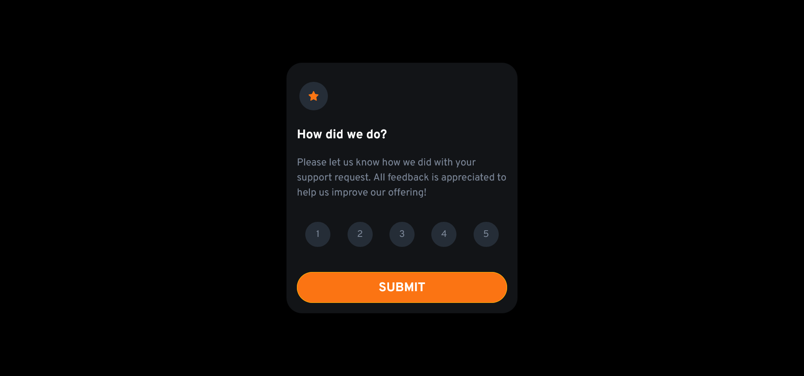
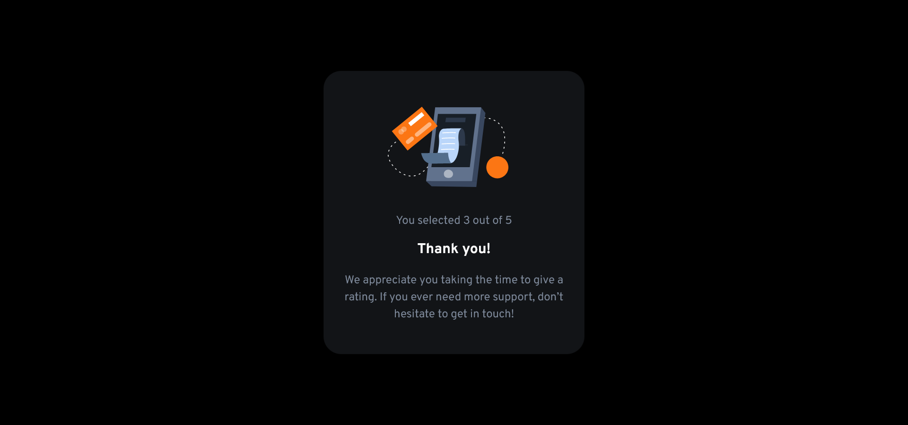
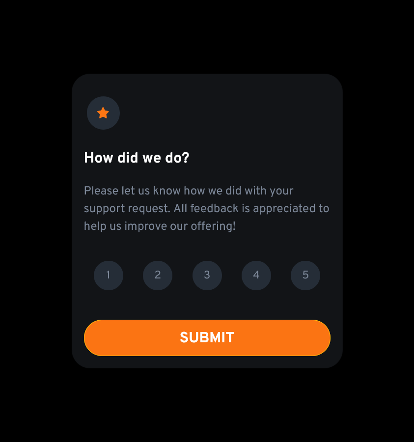

# Frontend Mentor - Interactive rating component solution

This is a solution to the [Interactive rating component challenge on Frontend Mentor](https://www.frontendmentor.io/challenges/interactive-rating-component-koxpeBUmI). Frontend Mentor challenges help you improve your coding skills by building realistic projects.

## Table of contents

- [Overview](#overview)
  - [The challenge](#the-challenge)
  - [Screenshot](#screenshot)
  - [Links](#links)
- [My process](#my-process)
  - [Built with](#built-with)
  - [Useful resources](#useful-resources)
- [Author](#author)

## Overview

### The challenge

Users should be able to:

- View the optimal layout for the app depending on their device's screen size
- See hover states for all interactive elements on the page
- Select and submit a number rating
- See the "Thank you" card state after submitting a rating

### Screenshot

### Links

- Live Site URL: (https://harshithrao07.github.io/Interactive-rating-component/)

## My process

### Built with

- Semantic HTML5 markup
- CSS custom properties
- Flexbox
- (https://getbootstrap.com/) Bootstrap v5.2
- (https://fonts.google.com/) Google Fonts

### Useful resources

- (https://www.sitepoint.com/community/t/select-one-button-deselect-other-buttons/348053) - This helped me to understand on how to select one button and deselect other buttons.

## Author

- Frontend Mentor - [@harshithrao07](https://www.frontendmentor.io/profile/harshithrao07)
- Instagram - [@harshith._.rao](https://www.instagram.com/harshith._.rao)
